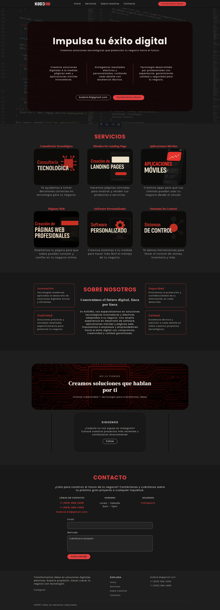
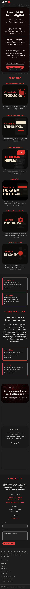

# Kod3rd Landing Page 🚀

Static Astro site for Kod3rd with local assets and JSON-driven content.

## Despliegue NixOS (módulo nativo)

Se eliminó el uso de `flake.nix` de este repo para dejar un módulo importable en tu host NixOS:
- `kod3.nix`

El módulo levanta la aplicación como **servicio systemd** en puerto **9200** y no depende de nginx ni Cloudflare en el repositorio.

### 1) Obtener `kod3.nix` desde GitHub (raw)

```bash
mkdir -p /etc/nixos/modules
curl -L https://raw.githubusercontent.com/osmargm1202/kod3rd/main/kod3.nix \
  -o /etc/nixos/modules/kod3.nix
```

### 2) O copiar desde este repositorio

```bash
scp /ruta/al/repositorio/kod3rd-landing/kod3.nix root@TU_SERVIDOR:/etc/nixos/modules/kod3.nix
```

### 3) Importar el módulo en tu host NixOS

Añade a `configuration.nix` (o `default.nix`/`hosts/<host>.nix`) el import del módulo:

```nix
imports = [
  ./modules/kod3.nix  # o la ruta donde lo guardaste
];
```

y activa el servicio:

```nix
services.kod3Landing = {
  enable = true;
  source = "/var/lib/kod3rd-landing";   # ruta del proyecto en el server
  bindAddress = "127.0.0.1";             # usa 0.0.0.0 si quieres exponer directo
  port = 9200;
  openFirewall = false;                  # true para exponer puerto directamente
  environment = {
    NODE_ENV = "production";
  };
  # environmentFile = "/etc/nixos/kod3.env"; # opcional, para secretos
};
```

## Despliegue con Docker

Opcional si prefieres no usar Nix para este servicio.

### Dockerfile

El `Dockerfile` ya deja la app construida (`dist/`) dentro de `nginx`:

```bash
# 1) Genera build de Astro primero
npm ci
npm run build

# 2) Construye imagen
# docker build -t kod3rd-landing .

docker build -t kod3rd-landing .

# 3) Levanta el contenedor
# por defecto expone 80 dentro del contenedor
docker run --rm -p 9200:80 kod3rd-landing
```

Acceso: `http://localhost:9200`

### Docker Compose

Puedes usar el `docker-compose.yml` incluido y ajustar puerto público con la asignación:

```bash
# editar docker-compose.yml -> "9200:80"
# luego:
docker compose up -d --build
```

Ejemplo básico de `docker-compose.yml`:

```yaml
services:
  web:
    build: .
    ports:
      - "9200:80"
    restart: unless-stopped
```

Con esto tienes dos vías de despliegue: NixOS service (9200) o contenedor Docker (9200).

## Capturas para README (generador dedicado full-page)

Para evitar artefactos de la captura anterior, se agregó un generador dedicado:
`fullpage-png/`.

Estructura:

- `fullpage-png/pyproject.toml`
- `fullpage-png/main.py`

Script recomendado (más simple):

```bash
# desktop
./scripts/capture-fullpage.sh -u http://127.0.0.1:4321/ -o ./assets/readme/home-desktop.png -w 1600
# tablet
./scripts/capture-fullpage.sh -u http://127.0.0.1:4321/ -o ./assets/readme/home-tablet.png -w 1024
# mobile
./scripts/capture-fullpage.sh -u http://127.0.0.1:4321/ -o ./assets/readme/home-mobile.png -w 390
```

Ejecutarlo directo con uv (Nix):

```bash
# con uv disponible en PATH
uv run --project ./fullpage-png main.py "http://127.0.0.1:4321/" --chromium "$(command -v chromium)" -o ./assets/readme/home-desktop.png --width 1600

# sin uv global (usando nix)
nix run nixpkgs#uv -- run --project ./fullpage-png main.py \
  "http://127.0.0.1:4321/" \
  --chromium "$(command -v chromium)" \
  -o ./assets/readme/home-desktop.png \
  --width 1600
```

Opcionales:

- `--width 390` para mobile, `--width 1024` para tablet.
- `--delay 1000` si necesitas esperar animaciones/recursos.

Comandos antiguos:

- `./scripts/screenshot.sh` sigue disponible para un flujo rápido en NixOS.

Resultado en README:






## Buenas prácticas Astro / JS en cliente

Esta implementación se dejó deliberadamente sin scripts globales en layout:
- Se eliminó `BaseLayout` script para Formspree.
- Se quitó script de animaciones del cliente y se dejó animación CSS pura.
- Se añadió formulario HTML puro en `/src/components/Contact.astro` (envío directo a Formspree por `POST`).

Si en el futuro necesitas interacciones cliente (sin usar React), puedes cargar HTMX de forma local en el servidor:

```bash
mkdir -p public/vendor
wget -O public/vendor/htmx.min.js https://unpkg.com/htmx.org@1.9.12/dist/htmx.min.js
```

Y usarlo con `defer` desde tu layout si es necesario.

### Variables de entorno

El servicio acepta:

- `services.kod3Landing.environment` (atributos Nix): se inyectan en systemd como `KEY=VALUE`.
- `services.kod3Landing.environmentFile` (opcional): ruta a archivo `KEY=VALUE` por línea para valores sensibles.

Ejemplo de archivo de entorno (`/etc/nixos/kod3.env`):

```bash
NODE_ENV=production
HOST=127.0.0.1
PORT=9200
```

### Comandos de build y despliegue

Si usas config no-flake:

```bash
sudo nixos-rebuild build
sudo nixos-rebuild switch
```

Si tu host usa flake:

```bash
sudo nixos-rebuild build --flake .#nombre-host
sudo nixos-rebuild switch --flake .#nombre-host
```

Verificación:

```bash
systemctl status kod3-landing
journalctl -u kod3-landing -n 200 --since "10 min ago"
curl http://127.0.0.1:9200
```

### Puertos usados

| Servicio | Puerto | Dirección |
|---|---:|---|
| kod3-landing | 9200 | loopback (`127.0.0.1`) por defecto |

---

## 📬 Contacto

📧 kod3rd.44@gmail.com  
📱 +1 (829) 868-2298  
📱 +1 (809) 988-4985  
📸 [Instagram @kod3rd](https://instagram.com/kod3rd)

© 2025 Kod3rd. All rights reserved.
